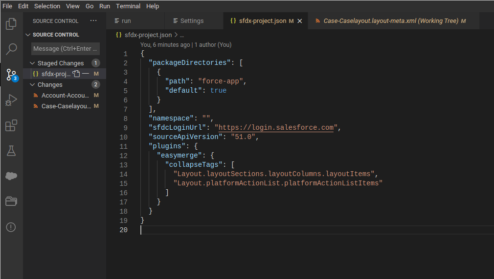
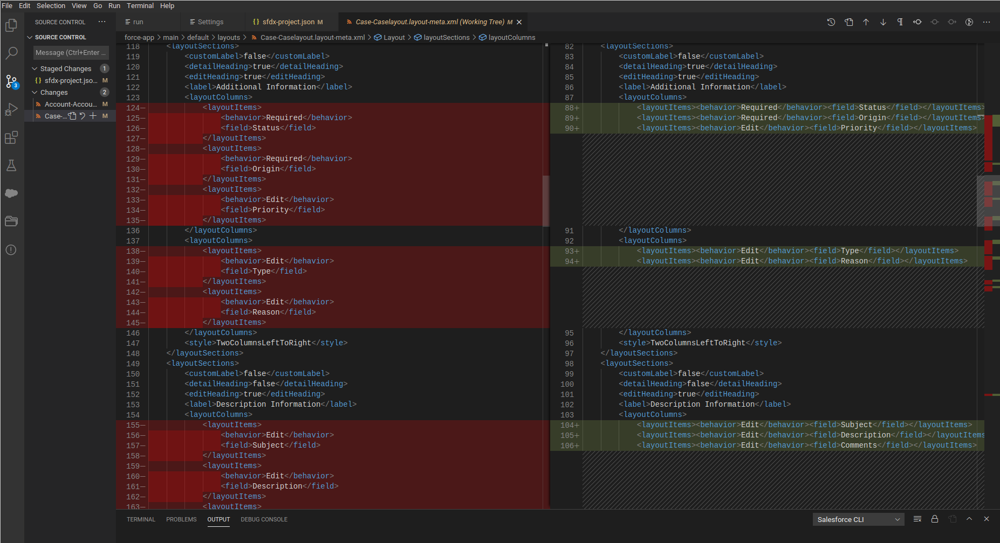

sfdx-plugin-easymerge
=====

[](https://npmjs.org/package/sfdx-plugin-easymerge)
[](https://greenkeeper.io/)
[](https://snyk.io/test/github/cmetz/sfdx-plugin-easymerge)
[](https://npmjs.org/package/sfdx-plugin-easymerge)
[](https://github.com/cmetz/sfdx-plugin-easymerge/blob/master/package.json)

SFDX plugin which reformats metadata for easier merge and conflict handling.

**Alpha release!**

It orders the plattformActionList by name on the layouts by hooking into sfdx retrieve.

It also allows you to configure nodes(tags) inside your xml-metadata which should not be pretty printed, by allowing them to be collapsed in a single line.

# Install

```sh-session
$ sfdx plugin:install sfdx-plugin-easymerge
```

# Configure collapsing

The collapsing can be configured in you sfdx-project.json.

Just add the complete XML-NodePath seperated by '.' the to the plugin configuration e.g.:

```
  "plugins": {
    "easymerge": {
      "collapseTags": [
        "Layout.layoutSections.layoutColumns.layoutItems",
        "Layout.platformActionList.platformActionListItems"
      ]
    }
  }
```

Like:

<br>

The Result after your next retrieve should contain the configured XML-NodePathes to by collapsed:

<br>
